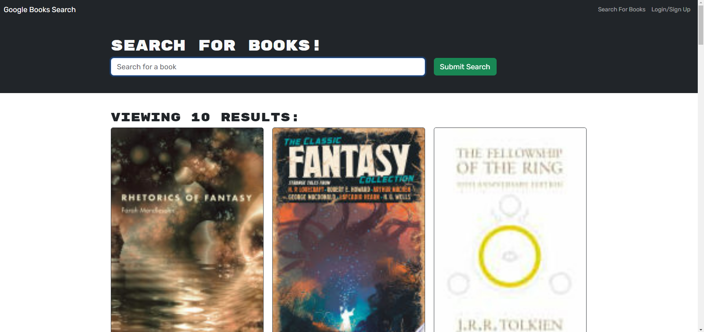

# Bibliophile-s-Oasis

Bibliophile's Oasis is a sophisticated web application for book enthusiasts, revolutionized to harness the power of GraphQL. Initially using a RESTful API, the app now integrates an Apollo Server, making data fetching and modifications more efficient and performant. This transition is aimed at meeting the dynamic demands of avid readers, providing them with a seamless experience in finding and saving their next great read.



## Table of Contents

- [Deployment](#deployment)
- [Installation](#installation)
- [Features](#features)
- [User Story](#user-story)
- [Technology](#technology)
- [Contributing](#contributing)
- [Acknowledgments](#acknowledgments)
- [Credits](#credits)

## Deployment

This application is deployed on Netlify. You can view the live application at [Link to web app](https://bibliophile-s-oasis-cca76726eb04.herokuapp.com/)

## Installation

To get started follow these steps:

1. Ensure you have [Node.js](https://nodejs.org/en/) installed on your machine.
2. Clone the repository to your local machine:

```bash
git clone git@github.com:rlobz/Bibliophile-s-Oasis.git
```

3. Navigate to the project directory:

```bash
cd Bibliophile-s-Oasis
```

4. Install the required npm packages from the root directory by running the following command in the terminal:

```bash
npm i && npm run dev
```

5. Open your browser and visit http://localhost:3001 to view the application.

## Features

- GraphQL API for efficient data fetching.
- Apollo Server integration for improved query handling.
- User authentication and personalized book saving.
- Responsive design for seamless user experience across devices.
- Real-time book search using Google Books API.
- Options to save and view favorite books.

## User Story

AS AN avid reader
I WANT to search for new books to read
SO THAT I can keep a list of books to purchase

## Technology

- MERN Stack (MongoDB, Express.js, React, Node.js)
- Apollo Server
- GraphQL
- Heroku
- MongoDB Atlas

## Contributing

Contributions to this project are welcome. Please ensure that your code adheres to the existing style and conventions.

## Acknowledgments

- Google Books API for providing a vast collection of book data.
- The open-source community for continuous support and resources.

## Credits

**Rafal Lobzowski**
- Github: [@rlobz](https://github.com/rlobz)